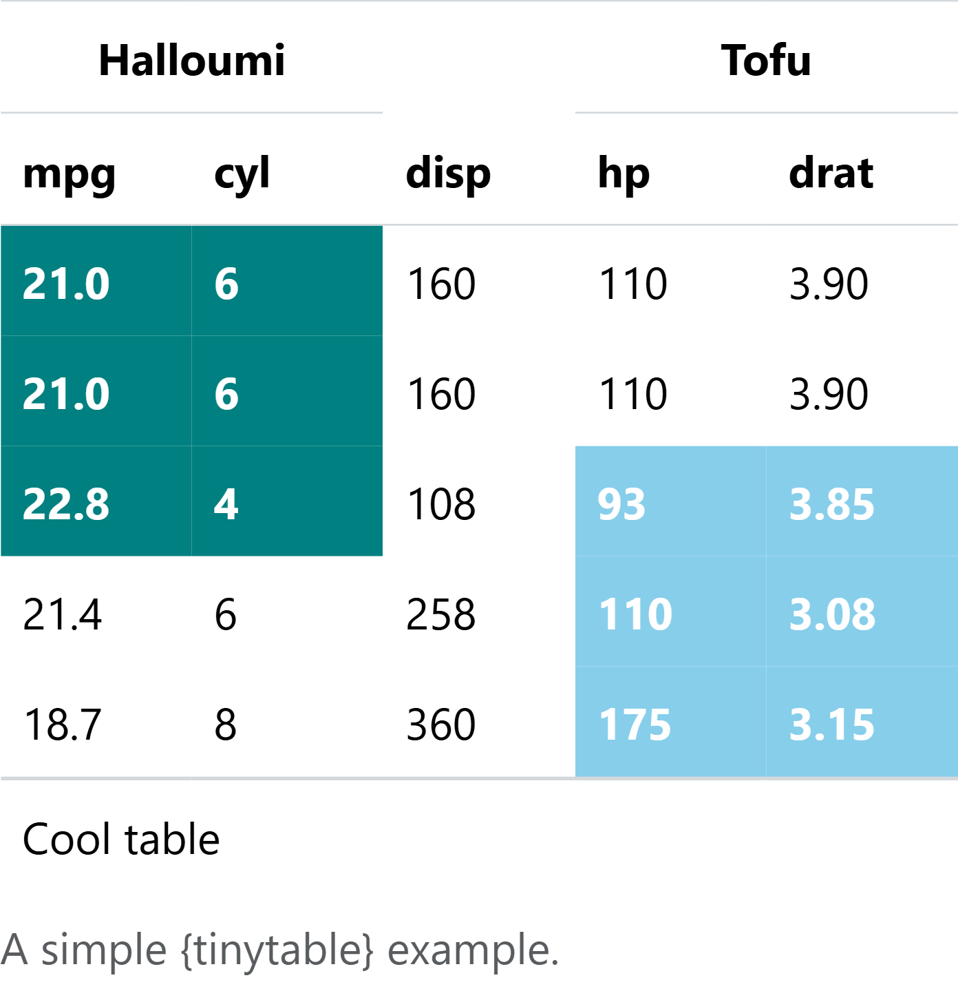
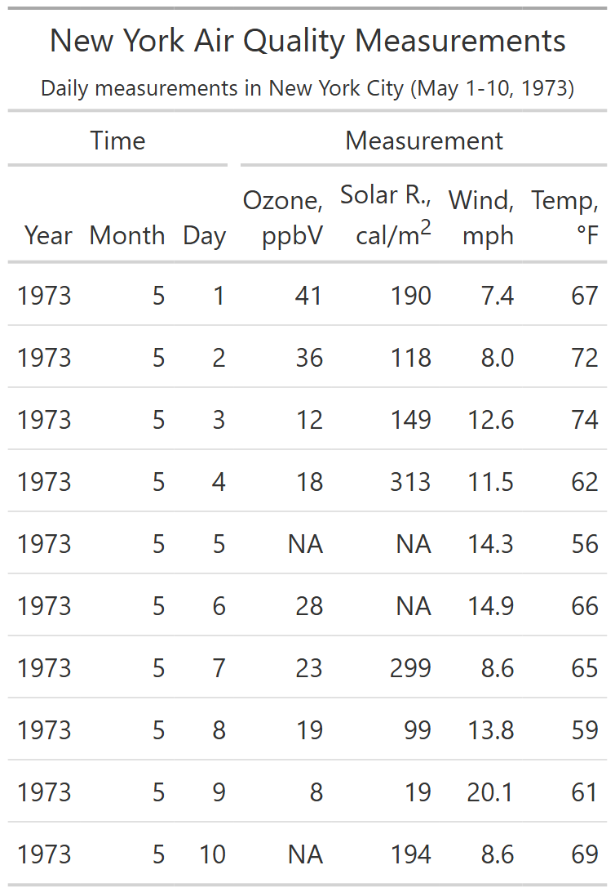
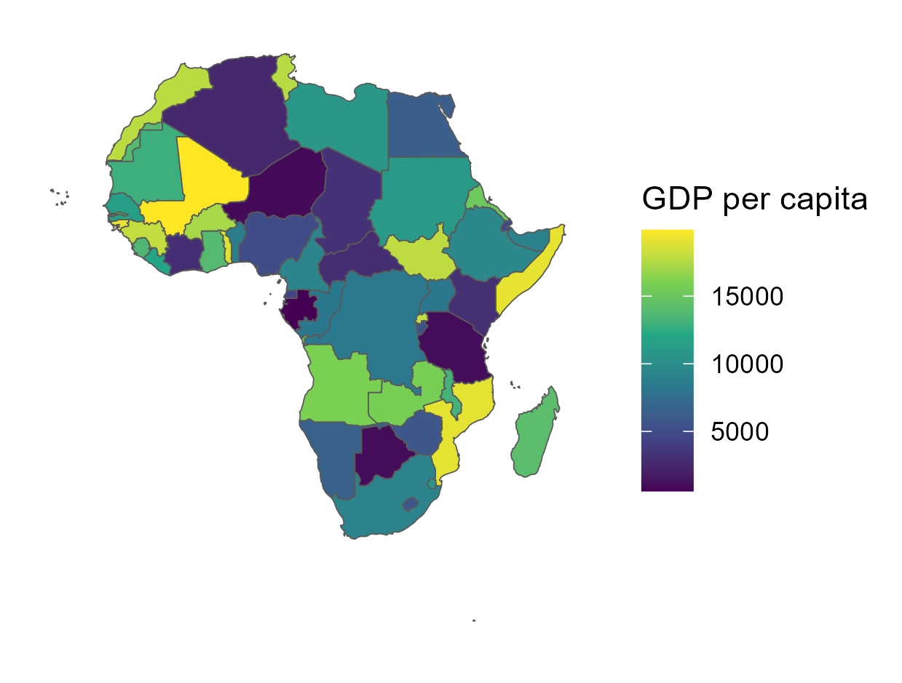
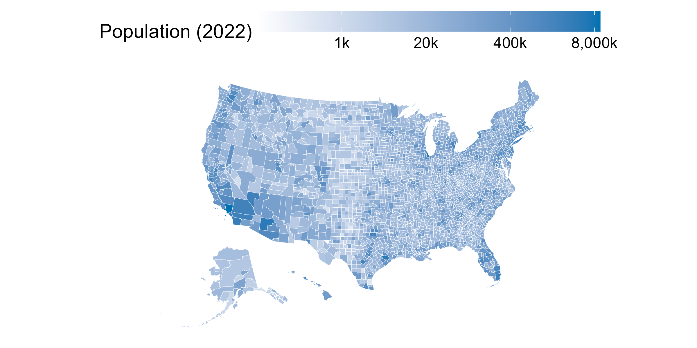

# Data Visualization Tutorials

Random sampling of tutorials that I have found useful.

***NOTE: Direct links to the code used to produce the image(s) below will be provided ASAP.***

## 1) Tinytables

Sample tinytable

## 2) Great Tables (gt)

Sample great table

## 3) GIS and Mapping

Africa Map with rnaturalearth and rworldmap

USA Map with usmap package

